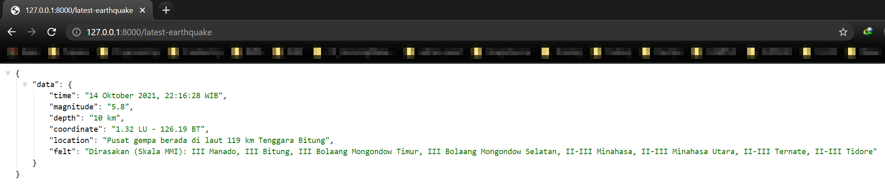
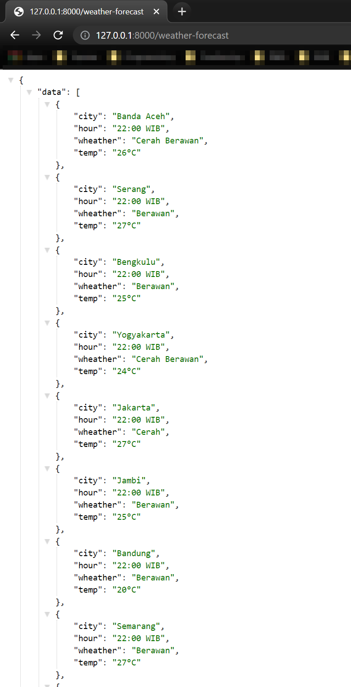

# Django3 - Consume BmkgInfo Library

Django3 Application to consume BmkgInfo Library and return it as JSON API

## Run Project

```bash
python manage.py runserver
```

## Preview

### Latest EartQuake



### Weather Forecast



## License

[MIT](https://choosealicense.com/licenses/mit/)
